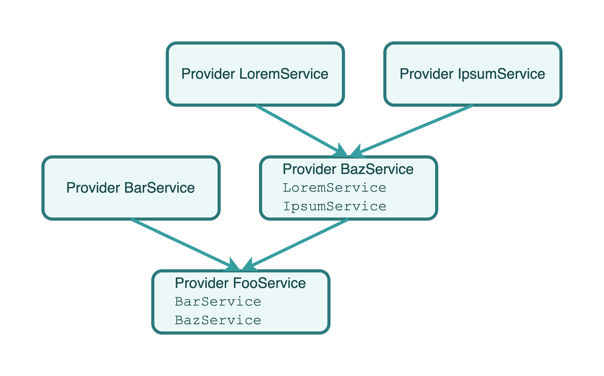
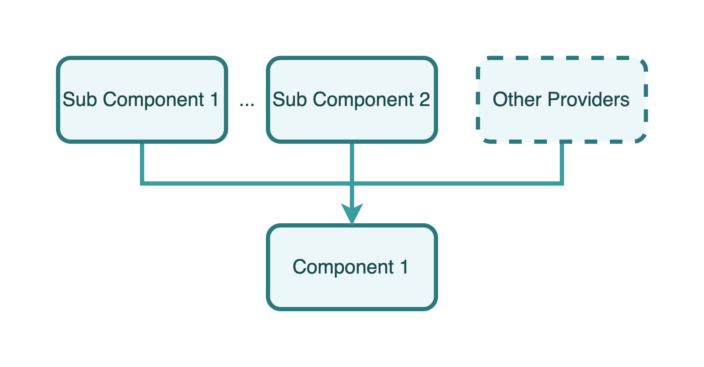

# Khamsa

Build your React.js apps by modules and dependency injecting.

## Introduction

Khamsa is a framework for building robust, clean and scalable React.js applications. It based on TypeScript and combines elements of OOP (Object Oriented Programming), FP (Functional Programming).

### Motivation

[React.js](https://reactjs.org) has greatly helped developers build fast and responsive web applications, while its simplicity has also allowed it to accumulate a large number of users in a short period of time, and some large websites have started to be built entirely using React.js. All of this speaks volumes about the success of React.js. However, there are a number of architectural problems with building large web applications using React.js that add up to additional and increasingly large expenses for maintaining and iterating on the project, and Khamsa was created to solve these problems.

Inspired by [Angular](https://angular.io) and [Nest.js](https://nestjs.com/) and based on React.js and [React Router](https://reactrouter.com/), Khamsa provides an out-of-the-box experience to help developers create highly available, highly maintainable, stable, and low-coupling React applications.

### Installation & Setup

#### Requirements

- (Required) Use TypeScript to write project
- (Required) React v16.8.0 or later
- (Required) React Router DOM v6.2.0 or later
- (Required) Webpack v5 or later
- (Recommended) Node.js v10.10.0 or later

#### Create a React.js + TypeScript Project With CRA

You can use the official-recommended CLI tools [CRA (create-react-app)](https://create-react-app.dev/) to generate the standard React.js App with TypeScript:

```bash
npm i create-react-app -g
mkdir example-project
cd example-project && create-react-app --template cra-template-typescript
```

#### Install Khamsa as a Dependency

In the root directory of your React.js app, run following command:

```bash
npm i khamsa -S
```

#### Configure TypeScript

In your `tsconfig.json` file in the project root directory, add following options into it:

```json
{
    "compilerOptions": {
        "emitDecoratorMetadata": true,
        "experimentalDecorators": true,
    },
}
```

#### Configure Babel

Install Babel plugins:

```
npm i babel-plugin-transform-typescript-metadata -D
npm i @babel/plugin-proposal-decorators -D
npm i @babel/plugin-proposal-class-properties -D
```

In your `.babelrc` or `.babelrc.json` or other types of configuration file for Babel, write the code as below:

```json
{
    "plugins": [
        "babel-plugin-transform-typescript-metadata",
        [
            "@babel/plugin-proposal-decorators",
            {
                "legacy": true,
            },
        ],
        [
            "@babel/plugin-proposal-class-properties",
            {
                "loose": true,
            },
        ],
    ]
}
```

> For [`CRA`](https://create-react-app.dev/) users, please checkout the example in [`config-overrides.js`](examples/config-overrides.js).

## Overview

### Providers

Providers are the most important and fundamental concept in Khamsa. Almost any class can be treated as a provider by Khamsa: services, components, tool libraries, etc. Khamsa makes it possible to establish various relationships between different provider objects by **injecting dependencies**.



As you can see in the image above, each provider can depend on another provider by passing parameters with the provider class as a type annotation in the constructor. With the Khamsa runtime, these type annotation-based provider parameters will be instantiated and made available when the web application starts.

### Components

**Components are also a type of provider**. Like normal providers, any provider (including components) can be injected into a component as a dependency, and similarly, a component can be injected into any provider as a dependency.



A view is a special component that is considered the carrier of a page in Khamsa. It can define routing paths, lazy loading fallbacks, and other options that are not supported by the component.

### Modules

A module is a class annotated with a `@Module()` decorator. The `@Module()` decorator provides metadata that Khamsa makes use of to organize the application structure.


When a Khamsa instance is to be initialized, one and only one module, called the **root module**, must be provided as the entry module for the application built by Khamsa.

## Usages

### Create a Provider

The following example shows how to create a provider:

```TypeScript
import { Injectable } from 'khamsa';

@Injectable()
export class DemoService {}
```

Is it unimaginably easy? Yes, that's all the things you should do to create a Provider.

If you want to use other providers as dependencies to be injected, you should declare them in as formal parameters:

```TypeScript
import { Injectable } from 'khamsa';
import { FooService } from '../foo/foo.service';

@Injectable()
export class DemoService {
    public constructor(
        private readonly fooService: FooService,
    ) {}
}
```

Then you can use `FooService`'s instance in `DemoService` by calling `this.fooService` signature.

### Create a Component

Before creating a component class, a JSX file (TSX for TypeScript) needs to be prepared to describe the structure of the component and the component interaction logic, then decorate a class with the @Component decorator and bring in the previous JSX/TSX file:

```ts
import Foo from './Foo';

@Component({
    component: Foo,
})
export class FooComponent {}
```

#### Dependency Injecting

Injecting dependency could be a little different from providers. You should specify the `declarations` parameter for `@Component` decorator. It is an array that includes the classes which the component class depends on:

```ts
@Component({
    component: Foo,
    declarations: [
        FooService,
        BarService,
        BarComponent,
    ],
})
export class FooComponent {}
```

#### Lazy Load Component

Khamsa supports lazy load based on React's `.lazy()` and `Suspense`.

### Create a Module

Module is also a normal class with a `@Module` decorator:

```TypeScript
import { Module } from 'khamsa';

@Module()
export class DemoModule {}
```

The `@Module()` decorator takes a single object as parameter whose properties describe the module:

- `imports: Array<Module>` - the list of imported modules that export the providers which are required in this module
- `providers: Array<Provider>` - the list of providers that the module hosts, which could probably be used by other modules
- `exports: Array<Provider>` - the subset of `providers` that are provided by this module and should be available in other modules which import this module
- `views: Array<ViewConfig>` - the set of views defined in this module which have to be instantiated

The definition of `ViewConfig` is like below:

- `id: string` - (required) defines the ID of current route view
- `path: string` - (required) defines the route that the view matches, must be an absolute path
- `provider: Type<AbstractComponent> | LazyLoadHandler` - the provider for view class
- `parent?: string` - defines the parent view of current view, if current view is a top-leveled view, let it be `null`
- `caseSensitive?: boolean` - defines the route matcher should use case-sensitive mode or not
- `index?: number` - specify if current view is an indexed route
- `priority?: number` - priority in current level routes, the value is bigger, The higher this value is, the better the chance of being matched with
- `elementProps?: any` - props for current view's React component
- `suspenseFallback?: boolean | null | React.ReactChild | React.ReactFragment | React.ReactPortal` - the value of `fallback` property for `React.Suspense`

#### Export & Import

Here is an example of using imports and exports to share providers between modules:

```
.
└── src/
    └── modules/
        ├── foo/
        │   ├── foo.module.ts
        │   └── foo.service.ts
        └── bar/
            ├── bar.module.ts
            └── bar.service.ts
```

`foo.service.ts` is a provider for the `FooModule`, which is declared and exported by the `FooModule`:

foo.service.ts
```ts
@Injectable()
export class FooService {
    public sayFooHello() {
        console.log('Greets from FooService!');
    }
}
```

foo.module.ts
```ts
@Module({
    providers: [
        FooService,
    ],
    exports: [
        FooService,
    ],
})
export class FooModule {}
```

Now, the `BarService` in the `BarModule` wants to have access to the `sayFooHello` method in the `FooService`, so the `FooModule` can be brought in via the imports option in `bar.module.ts`:

bar.module.ts
```ts
@Module({
    imports: [
        FooModule,
    ],
    providers: [
        BarService,
    ],
})
export class BarModule {}
```

Next, the `BarService` in `bar.service.ts` can pass the `FooService` as a type annotation with one parameter into the constructor:

bar.service.ts
```ts
@Injectable()
export class BarService {
    public constructor(
        private readonly fooService: FooService,
    ) {}

    public sayBarHello() {
        console.log('Greets from BarService!');
        this.fooService.sayFooHello();
    }
}
```

#### Declare Views

Following the previous example, now the project looks like this:

```
.
└── src/
    └── modules/
        ├── foo/
        │   ├── foo.module.ts
        │   └── foo.service.ts
        │   └── foo.view.ts
        └── bar/
            ├── bar.module.ts
            └── bar.service.ts
```

the content is `foo.view.ts` looks like:

```tsx
import { FunctionComponent } from 'react';
import {
    AbstractComponent,
    Injectable,
} from 'Khamsa';

@Injectable()
export class FooView extends AbstractComponent implements AbstractComponent {
    protected async generateComponent(): Promise<FunctionComponent<any>> {
        return () => <p>Foo page is working!</p>;
    }
}
```

also a line should be added into `foo.module.ts`:

```ts
@Module({
    providers: [
        FooService,
    ],
    exports: [
        FooService,
    ],
    views: [
        {
            path: '/foo',
            provider: FooView,
        },
    ],
})
export class FooModule {}
```

If you want to use [React's lazy load features](https://reactjs.org/docs/code-splitting.html#reactlazy), you can change `foo.module.ts`'s content like:

```ts
@Module({
    providers: [
        FooService,
    ],
    exports: [
        FooService,
    ],
    views: [
        {
            path: '/foo',
            provider: (parse) => () => parse(import('./foo.view')),
        },
    ],
})
export class FooModule {}
```

you should change `views[].provider` to a function that returns a [lazy load factory](https://github.com/facebook/react/blob/main/packages/react/src/ReactLazy.js#L122), which would be taken by `React.lazy` as its first argument. Khamsa provides a function named `parse` to help you create a dynamic-imported component from an `AbstractComponent` instance.

### Organize App

See [this code](examples/src/index.tsx) to get detailed information of how to create a React.js App by Khamsa.

## Participate in Project Development

Getting involved in the development of Khamsa is welcomed. But before that, please read the [Code of Conduct](CODE_OF_CONDUCT.md) of Khamsa. You can also read [this doc](.github/CONTRIBUTING.md) to get more information about contribute your code into this repository.

> Before starting working on the project, please upgrade your Node.js version to v14.15.0 or later.

## Sponsorship

We accept sponsorship and are committed to spending 100% of all sponsorship money on maintaining Khamsa, including but not limited to purchasing and maintaining the Khamsa documentation domain, servers, and paying stipends to some of our core contributors.

Before initiating a sponsorship, please send an email to [i@lenconda.top](i@lenconda.top) or [prexustech@gmail.com](prexustech@gmail.com) with your name, nationality, credit card (VISA or MasterCard) number, what problem Khamsa has helped you solve (optional), and a thank-you message (optional), etc. After review and approval, we will reply with an email with a payment method that you can complete the sponsorship via this email.

Thank you so much for your support of the Khamsa project and its developers!
