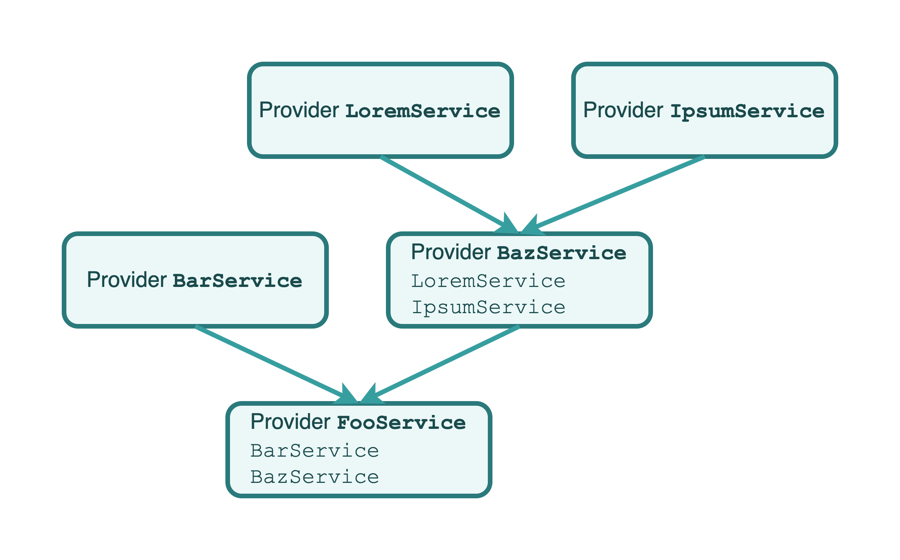
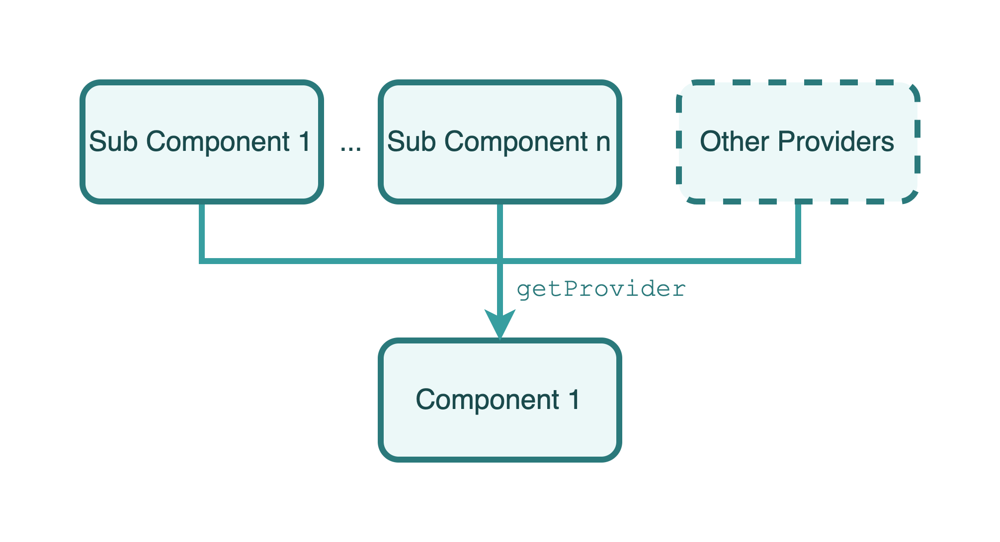
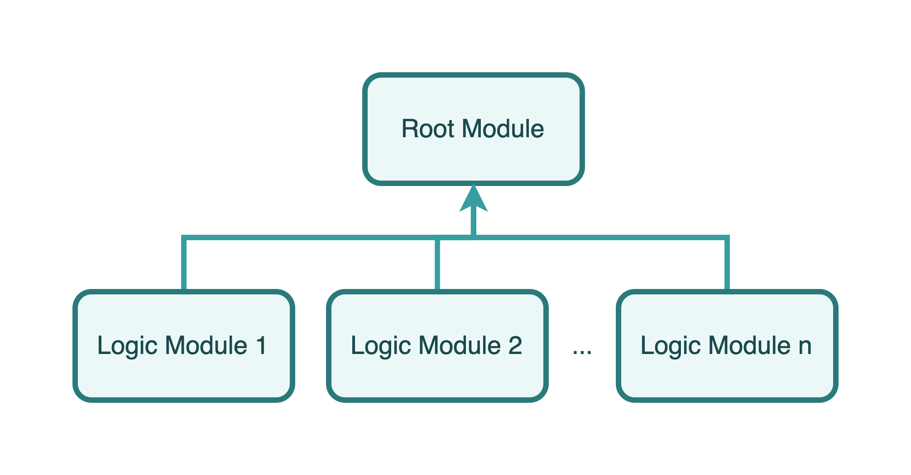

<p align="center">
    <a href="https://agrosjs.github.io">
        
    </a>
</p>

<p align="center">Build your React.js apps by modules and dependency injecting.</p>

<p align="center">
  <a href="https://github.com/agrosjs/agros/blob/master/LICENSE"></a>
  <a href="https://www.npmjs.com/package/@agros/app"></a>
  <a href="https://www.npmjs.com/package/@agros/app"></a>
</p>

---

# Introduction

Agros is a framework for building robust, clean and scalable React.js applications. It based on TypeScript and combines elements of OOP (Object Oriented Programming), FP (Functional Programming).

## Motivation

[React.js](https://reactjs.org) has greatly helped developers build fast and responsive web applications, while its simplicity has also allowed it to accumulate a large number of users in a short period of time, and some large websites have started to be built entirely using React.js. All of this speaks volumes about the success of React.js. However, there are a number of architectural problems with building large web applications using React.js that add up to additional and increasingly large expenses for maintaining and iterating on the project, and Agros was created to solve these problems.

Inspired by [Angular](https://angular.io) and [Nest.js](https://nestjs.com/) and based on React.js and [React Router](https://reactrouter.com/), Agros provides an out-of-the-box experience to help developers create highly available, highly maintainable, stable, and low-coupling React applications.

## Installation & Setup

### Requirements

- (Required) Use TypeScript to write project
- (Required) React v16.8.0 or later
- (Required) React Router DOM v6.2.0 or later
- (Required) Webpack v5 or later
- (Recommended) Node.js v10.10.0 or later

### Quick Start

#### Install Agros CLI

The Agros CLI helps you easily make and configure collections (providers, components and modules) into your projects, which is useful when the structure project is increasing.

```
npm i @agros/cli --location=global
```

Here comes the usages of Agros CLI:

```
Usage: agros [options] [command]

Options:
  -V, --version   output the version number
  -h, --help      display help for command

Commands:
  generate|g      Generate Agros.js collections
  update|u        Update an Agros.js collections with another collection
  routes|r        Manage project routes
  help [command]  display help for command
```

#### Create an Agros project

Create an Agros project by Agros CLI:

```bash
agros generate application
```

As an alternative, you can also use Agros official-recommended scaffold `@agros/create-app` and prepare project directory:

```bash
npm i @agros/create-app --location=global
mkdir example-project && cd example-project
```

Run create command:

```bash
npm create @agros/app
# or
create-agros-app
```

Follow the instruction and the project will be initialized in the directory.

#### Configure TypeScript

In your `tsconfig.json` file in the project root directory, add following options into it:

```json
{
    "compilerOptions": {
        "emitDecoratorMetadata": true,
        "experimentalDecorators": true,
    },
}
```

#### Run the Project

```bash
npm start
# or
npx agros-app start
```

#### Build the Project

```bash
npm run build
# or
npx agros-app build
```

# Overview

## Providers

Providers are the most important and fundamental concept in Agros. Almost any class can be treated as a provider by Agros: services, interceptors, tool libraries, etc. Agros makes it possible to establish various relationships between different provider objects by **injecting dependencies**.



As you can see in the image above, each provider can depend on another provider by passing parameters with the provider class as a type annotation in the constructor. With the Agros runtime, these type annotation-based provider parameters will be instantiated and made available when the web application starts.

## Components

**Components are also a type of provider**. Like normal providers, any provider (including components) can be injected into a component as a dependency, and similarly, a component can be injected into any provider as a dependency.



A view is a special component that is considered the carrier of a page in Agros. It can define routing paths, lazy loading fallbacks, and other options that are not supported by the component.

## Modules

A module is a class annotated with a `@Module()` decorator. The `@Module()` decorator provides metadata that Agros makes use of to organize the application structure.



When a Agros instance is to be initialized, one and only one module, called the **root module**, must be provided as the entry module for the application built by Agros.

# Usages

## Create a Provider

> Use of Agros CLI: `agros generate {service|interceptor|...} demo`

The following example shows how to create a provider:

```TypeScript
// demo.service.ts
import { Injectable } from '@agros/app';

@Injectable()
export class DemoService {}
```

If you want to use other providers as dependencies to be injected, you should declare them in as formal parameters:

```TypeScript
// demo.service.ts
import { Injectable } from '@agros/app';
import { FooService } from '../foo/foo.service';

@Injectable()
export class DemoService {
    public constructor(
        private readonly fooService: FooService,
    ) {}
}
```

Then you can use `FooService`'s instance in `DemoService` by calling `this.fooService` signature.

## Create a Component

> Useage of Agros CLI: `agros generate component foo`

Before creating a component class, a JSX file (TSX for TypeScript) defaultly exports the component needs to be prepared to describe the structure of the component and the component interaction logic, then decorate a class with the @Component decorator and bring in the previous JSX/TSX file:

```tsx
// Foo.tsx
import { FC } from 'react';

export default Foo: FC = () => {
    return <>Foo Component is Working!</>;
}
```

```ts
// foo.component.ts
@Component({
    file: './Foo',
})
export class FooComponent {}
```

### Dependency Injecting

Injecting dependency could be a little different from providers. You should specify the `declarations` parameter for `@Component` decorator. It is an array that includes the classes which the component class depends on:

```ts
// foo.component.ts
@Component({
    file: './Foo',
    declarations: [
        FooService,
        BarService,
        BarComponent,
    ],
})
export class FooComponent {}
```

in the JSX/TSX file, you can deconstruct a property named `declarations` and use the `get` methods in it to use your injected providers:

```tsx
// Foo.tsx
import { FC } from 'react';
import { getContainer } from '@agros/app';
import { BarComponent } from '../bar/bar.component';
import { FooService } from '../foo/foo.service';
import { BarService } from '../bar/bar.service';

export default Foo: FC = () => {
    /**
     * pass the `Foo` itself to `getContainer`
    */
    const container = getContainer(Foo);
    const Bar = declarations.get<FC<PropsWithChildren>>(BarComponent);
    const fooService = declarations.get<FooService>(FooService);
    const barService = declarations.get<BarService>(BarService);
}
```

### `forwardContainer`

Agros provides a top-level API called `forwardContainer` to help you obtain references to containers when using [React HOC](https://reactjs.org/docs/higher-order-components.html):

```tsx
// Foo.tsx

import {
    FC,
    memo,
} from 'react';
import { forwardContainer } from '@agros/app';
import { BarComponent } from '../bar/bar.component';
import { FooService } from '../foo/foo.service';
import { BarService } from '../bar/bar.service';

const Foo: FC = forwardContainer(({ props, container }) => {
    const Bar = container.get<FC<PropsWithChildren>>(BarComponent);
    const fooService = container.get<FooService>(FooService);
    const barService = container.get<BarService>(BarService);
});

export default memo(Foo);
```

### Lazy Load

Agros supports lazy load based on React's [`.lazy`](https://zh-hans.reactjs.org/docs/code-splitting.html#reactlazy) and [`Suspense`](https://reactjs.org/docs/react-api.html#reactsuspense):

```ts
// foo.component.ts
@Component({
    file: './Foo',
    lazy: true,
    suspenseFallback: 'loading...',
})
export class FooComponent {}
```

### Error Boundaries

You can define a custom boundary component for every components in Agros:

```tsx
// foo-boundary.component.tsx
import { Component } from '@agros/app';
import FooBoundary from './FooBoundary';

@Component({
    file: './FooBoundary',
    boundary: {
        fallback: 'ERROR CAUGHT',
    },
})
export class FooBoundaryComponent {}
```

The definition of `@Component`'s parameters are like below:

- `file?: string` - the relative path between component file and component declaration file
- `lazy?: boolean` - `default: false` the provider will be lazily loaded when this is set `true`
- `styles?: string[]` - the pathnames of style files
- `boundary?: ErrorBoundaryProps` - props for `react-error-boundary`, see [this](https://github.com/bvaughn/react-error-boundary/blob/master/src/index.tsx#L60) to get more details
- `declarations?: Array<Type>` - the provider classes depended by current component
- `elementProps?: any` - props for current view's React component
- `suspenseFallback?: boolean | null | React.ReactChild | React.ReactFragment | React.ReactPortal` - the value of `fallback` property for `React.Suspense`
- `suspenseFallback?: boolean | null | React.ReactChild | React.ReactFragment | React.ReactPortal` - the placeholder element for interceptors when the interceptors are loading

## Create a Module

> Usage of Agros CLI: `agros generate module demo`

Module is also a normal class with a `@Module` decorator:

```TypeScript
// demo.module.ts
import { Module } from '@agros/app';

@Module()
export class DemoModule {}
```

### Export & Import

Here is an example of using imports and exports to share providers between modules:

```
.
└── src/
    └── modules/
        ├── foo/
        │   ├── foo.module.ts
        │   └── foo.service.ts
        └── bar/
            ├── bar.module.ts
            └── bar.service.ts
```

`foo.service.ts` is a provider for the `FooModule`, which is declared and exported by the `FooModule`:

```ts
// foo.service.ts
@Injectable()
export class FooService {
    public sayFooHello() {
        console.log('Greets from FooService!');
    }
}
```

```ts
// foo.module.ts
@Module({
    providers: [
        FooService,
    ],
    exports: [
        FooService,
    ],
})
export class FooModule {}
```

Now, the `BarService` in the `BarModule` wants to have access to the `sayFooHello` method in the `FooService`, so the `FooModule` can be brought in via the imports option in `bar.module.ts`:

```ts
// bar.module.ts
@Module({
    imports: [
        FooModule,
    ],
    providers: [
        BarService,
    ],
})
export class BarModule {}
```

Next, the `BarService` in `bar.service.ts` can pass the `FooService` as a type annotation with one parameter into the constructor:

```ts
// bar.service.ts
@Injectable()
export class BarService {
    public constructor(
        private readonly fooService: FooService,
    ) {}

    public sayBarHello() {
        console.log('Greets from BarService!');
        this.fooService.sayFooHello();
    }
}
```

### Code Splitting When Importing Modules

With Webpack 5's [code splitting](https://webpack.js.org/guides/code-splitting/) feature, Agros will also split your code when you use dynamic imports to import modules:

```ts
// bar.module.ts

@Module({
    imports: [
        import('../foo/foo.module').then(({ FooModule }) => FooModule),
    ],
    providers: [
        BarService,
    ],
})
export class BarModule {}
```

### Configuring Routes

Following the previous example, now the project looks like this:

```
.
└── src/
    └── modules/
        ├── foo/
        │   ├── foo.module.ts
        │   ├── foo.service.ts
        │   ├── foo.component.ts
        │   └── Foo.tsx
        └── bar/
            ├── bar.module.ts
            └── bar.service.ts
```

You should add `routes` option to `@Module`:

```ts
// foo.module.ts

@Module({
    components: [
        FooComponent,
    ],
    providers: [
        FooService,
    ],
    exports: [
        FooService,
    ],
    routes: [
        {
            path: 'foo',
            useComponentClass: FooComponent,
        },
    ],
})
export class FooModule {}
```

Agros will parse the route config and get a path of `/foo` who renders `Foo.tsx`.

You can also use a module class to configure the routes by passing `useModuleClass` option. Now the project looks like this:

```
.
└── src/
    └── modules/
        ├── foo/
        │   ├── foo.module.ts
        │   ├── foo.service.ts
        │   ├── foo.component.ts
        │   └── Foo.tsx
        ├── bar/
        │   ├── bar.module.ts
        │   └── bar.service.ts
        └── baz/
            ├── baz.module.ts
            ├── baz.service.ts
            ├── baz-child.component.ts
            ├── BazChild.tsx
            ├── baz.component.ts
            └── Baz.tsx
```

The `baz.module.ts`'s definition looks like this:

```ts
// baz.module.ts

@Module({
    components: [
        BazComponent,
        BazChildComponent,
    ],
    providers: [
        BazService,
    ],
    exports: [
        BazComponent,
        BazChildComponent,
        BazService,
    ],
    routes: [
        {
            path: 'baz',
            useComponentClass: BazComponent,
            children: [
                {
                    path: 'child',
                    useComponentClass: BazChildComponent,
                },
            ],
        },
    ],
})
export class BazModule {}
```

and the `foo.module.ts`'s content:

```ts
// foo.module.ts

@Module({
    imports: [
        BazModule,
    ],
    components: [
        FooComponent,
    ],
    providers: [
        FooService,
    ],
    exports: [
        FooService,
    ],
    routes: [
        {
            path: 'foo',
            useComponentClass: FooComponent,
            children: [
                {
                    useModuleClass: BazModule,
                },
            ],
        },
    ],
})
export class FooModule {}
```

Agros will parse it into `/foo`, `/foo/baz` and `/foo/baz/child` routes.

The `@Module()` decorator takes a single object as parameter whose properties describe the module:

- `imports: Array<Module>` - the list of imported modules that export the providers which are required in this module
- `providers: Array<Provider>` - the list of providers that the module hosts, which could probably be used by other modules
- `components: Array<Component>` - the list of components provided by current module
- `exports: Array<Provider>` - the subset of `providers` that are provided by this module and should be available in other modules which import this module
- `routes: Array<RouteOptionItem>` - the list of routes provided by current module

The definition of `RouteOptionItem` is like below:

- `path: string` - (required) defines the route that the view matches, must be an absolute path
- `useComponentClass?: Type` - the provider who carries the component class
- `useModuleClass?: Type` - the provider who carries a module class with routes config
- `caseSensitive?: boolean` - defines the route matcher should use case-sensitive mode or not
- `index?: number` - specify if current view is an indexed route

## Make the Entry Point Available

An Agros project should contain one entry, which is usally at file `src/index.ts` or another user-specified file. In this file, a default-exported array contains root points should be specified that Agros can read it and load from it.

Example:

```
import './index.css';
import { HashRouter } from '@agros/app/lib/router';
import { AppModule } from '@/app.module';

export default [
    {
        module: AppModule,
        container: document.getElementById('root'),
        RouterComponent: HashRouter,
    },
];
```

# Participate in Project Development

Getting involved in the development of Agros is welcomed. But before that, please read the [Code of Conduct](CODE_OF_CONDUCT.md) of Agros. You can also read [this doc](.github/CONTRIBUTING.md) to get more information about contribute your code into this repository.

> Before starting working on the project, please upgrade your Node.js version to v14.15.0 or later.

# Sponsorship

We accept sponsorship and are committed to spending 100% of all sponsorship money on maintaining Agros, including but not limited to purchasing and maintaining the Agros documentation domain, servers, and paying stipends to some of our core contributors.

Before initiating a sponsorship, please send an email to [i@lenconda.top](i@lenconda.top) or [prexustech@gmail.com](prexustech@gmail.com) with your name, nationality, credit card (VISA or MasterCard) number, what problem Agros has helped you solve (optional), and a thank-you message (optional), etc. After review and approval, we will reply with an email with a payment method that you can complete the sponsorship via this email.

Thank you so much for your support of the Agros project and its developers!
