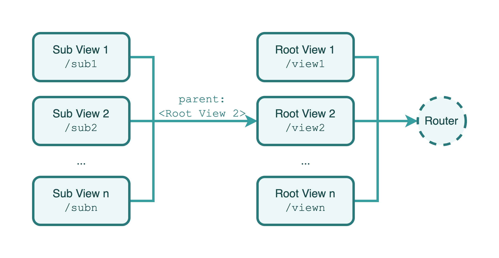

# Khamsa

Build your React.js apps by modules and dependency injecting.

## Introduction

Khamsa is a framework for building robust, clean and scalable React.js applications. It based on TypeScript and combines elements of OOP (Object Oriented Programming), FP (Functional Programming).

### Motivation

React.js has greatly helped developers build fast and responsive web applications, while its simplicity has also allowed it to accumulate a large number of users in a short period of time, and some large websites have started to be built entirely using React.js. All of this speaks volumes about the success of React.js. However, there are a number of architectural problems with building large web applications using React.js that add up to additional and increasingly large expenses for maintaining and iterating on the project, and Khamsa was created to solve these problems.

Inspired by [Angular](https://angular.io) and [Nest.js](https://nestjs.com/), Khamsa provides an out-of-the-box experience to help developers create highly available, highly maintainable, stable, and low-coupling web applications.

### Installation & Setup

#### Requirements

- (Required) Use TypeScript to write project
- (Recommended) Node.js v10.10.0 and later

#### Create a React.js + TypeScript Project With CRA

You can use the official-recommended CLI tools [CRA (create-react-app)](https://create-react-app.dev/) to generate the standard React.js App with TypeScript:

```bash
npm i create-react-app -g
mkdir example-project
cd example-project && create-react-app --template cra-template-typescript
```

#### Install Khamsa as a Dependency

In the root directory of your React.js app, run following command:

```bash
npm i khamsa -S
```

#### Configure TypeScript

In your `tsconfig.json` file in the project root directory, add following options into it:

```json
{
    // ...
    "compilerOptions": {
        // ...
        "emitDecoratorMetadata": true,
        "experimentalDecorators": true,
    },
    //...
}
```

#### Configure Babel

Install Babel plugins:

```
npm i babel-plugin-transform-typescript-metadata -D
npm i @babel/plugin-proposal-decorators -D
npm i @babel/plugin-proposal-class-properties -D
```

In your `.babelrc` or `.babelrc.json` or other types of configuration file for Babel, write the code as below:

```json
{
    "plugins": [
        "babel-plugin-transform-typescript-metadata",
        [
            "@babel/plugin-proposal-decorators",
            {
                "legacy": true,
            },
        ],
        [
            "@babel/plugin-proposal-class-properties",
            {
                "loose": true,
            },
        ],
    ]
}
```

> For [`CRA`](https://create-react-app.dev/) users, please checkout the example in [`config-overrides.js`](examples/config-overrides.js).

## Overview

### Providers

Providers are the most important and fundamental concept in Khamsa. Almost any class can be treated as a provider by Khamsa: services, components, tool libraries, etc. Khamsa makes it possible to establish various relationships between different provider objects by *injecting dependencies*.


As you can see in the image above, each provider can depend on another provider by passing parameters with the provider class as a type annotation in the constructor. Thanks to the Khamsa runtime, these type annotation-based provider parameters are instantiated and made available when the web application starts.

### Components & Views




### Modules

A module is a class annotated with a `@Module()` decorator. The `@Module()` decorator provides metadata that Khamsa makes use of to organize the application structure.


When a Khamsa instance is to be initialized, one and only one module, called the **root module**, must be provided as the entry module for the application built by Khamsa.

## Usages

### Create a Provider

### Create a Component

### Declare a Component as View

### Create a Module

### Use Providers from External Modules

## Participate in Project Development

Getting involved in the development of Khamsa is welcomed. But before that, please read the [Code of Conduct](CODE_OF_CONDUCT.md) of Khamsa. You can also read [this doc](.github/CONTRIBUTING.md) to get more information about contribute your code into this repository.

> Before starting working on the project, please upgrade your Node.js version to v14.15.0 or later.

## Sponsorship

We accept sponsorship and are committed to spending 100% of all sponsorship money on maintaining Khamsa, including but not limited to purchasing and maintaining the Khamsa documentation domain, servers, and paying stipends to some of our core contributors.

Before initiating a sponsorship, please send an email to [i@lenconda.top](i@lenconda.top) or [prexustech@gmail.com](prexustech@gmail.com) with your name, nationality, credit card (VISA or MasterCard) number, what problem Khamsa has helped you solve (optional), and a thank-you message (optional), etc. After review and approval, we will reply with an email with a payment method that you can complete the sponsorship via this email.

Thank you so much for your support of the Khamsa project and its developers!
